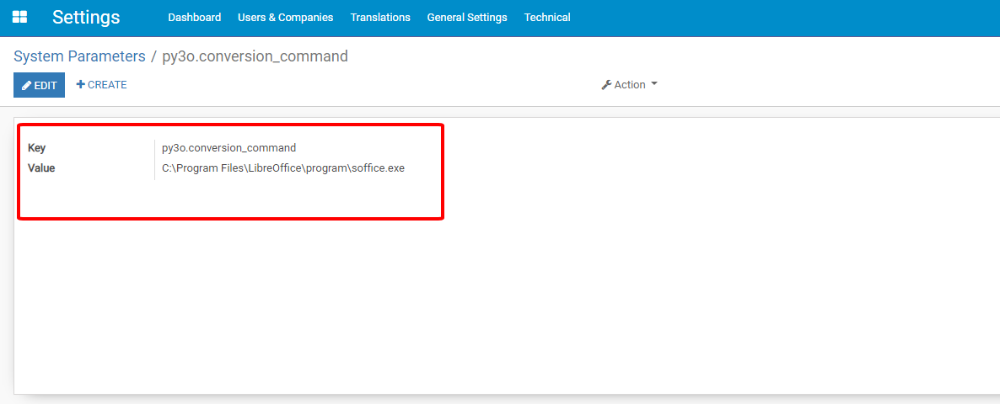
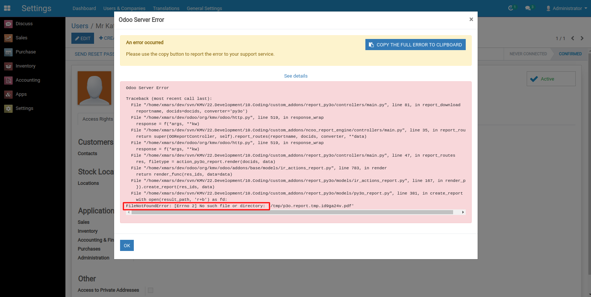
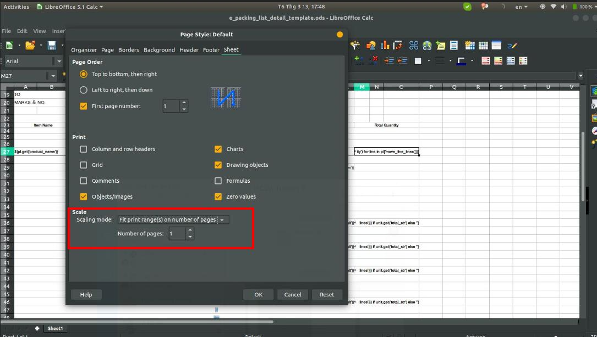
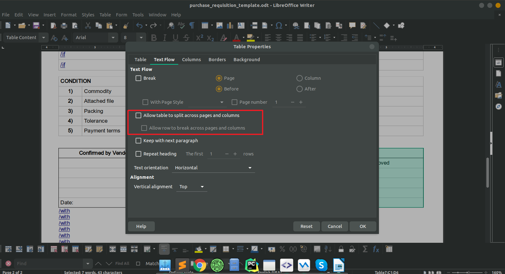

## Prerequisite

1. Follow the instruction in **README.rst** file to install all required libraries
2. Add a *system parameter* named **py3o.conversion_command** to Odoo



with *Value* is the path to *Libreoffice runtime*:
+ Windows OS: *C:\Program Files\LibreOffice\program\soffice.exe*
+ Linux/Unix OS: *libreoffice*


## Demonstration
I. Prepare<br/>
All the content is in the *report_py3o/demo* folder.<br/>
You need to declare some files so you can see the demo running on the real **User** form.<br/>
1. Add this line to the end of the file *report_py3o/__init__.py*
```bash
from . import demo
```
2. Add these lines to the section *views* in file *report_py3o/__manifest__.py*
```bash
'demo/res_users_views.xml',
'demo/res_users_templates.xml'
```

II. Try the demo
After step **I**, on the *res.uses* form, you can see two buttons:
+ Print Py3o XLS
+ Print Py3o PDF

======Enjoy it!======


III. Attentions
+ If you got this error or something like this when printing, please close all libreoffice instances and print again



+ Different versions of Libreoffice can issue some different formats so when you develop a report, make sure the libreoffice on your local server and the libreoffice on the production server are the same.

+ When your template file type is *ods*, change this configuration so the file printed will be incorrect format<br/>
*Format -> Page -> Sheet*



+ Prevent a table in *odt* file split multi pages and columns, uncheck this option


